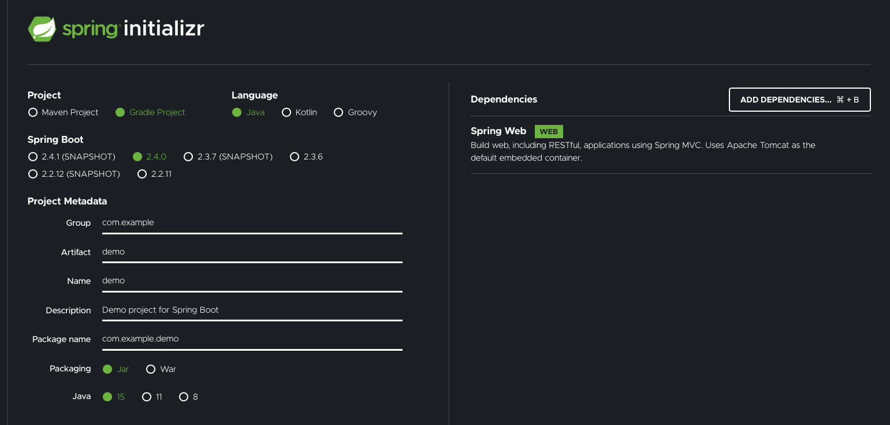
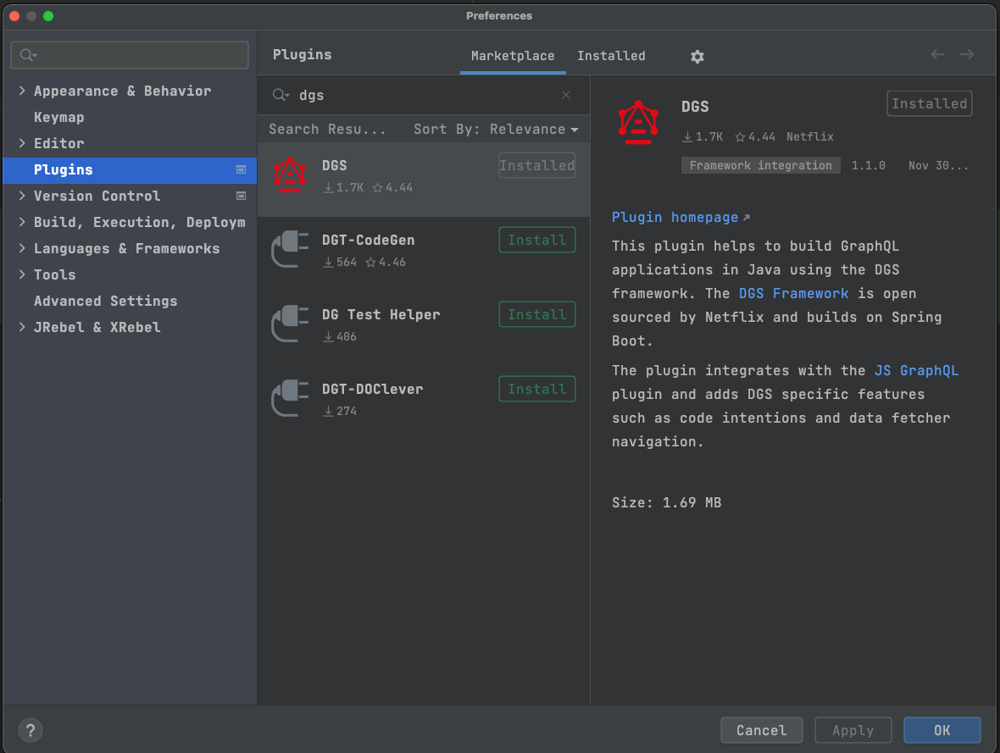

# 开始
> 原始文档链接：https://netflix.github.io/dgs/getting-started/

import Tabs from '@theme/Tabs';
import TabItem from '@theme/TabItem';
import CodeBlock from '@theme/CodeBlock';

## 创建一个新的SpringBoot 项目
`DGS` 框架是基于 SpringBoot3.0 的，所以如果你当前暂时还没有应用的话，请基于 SpringBoot 3.0 创建一个应用。同时也请注意，你仍然可以在 SpringBoot 2.7 环境下使用`5.5.x`版本的DGS框架。但是`6.x`版本的`DGS`框架将要求使用 `SpringBoot 3`. 使用 Spring Initializr 是创建SpringBoot 应用的一个非常好简单方式。你可以基于`Java 17`或者`Kotlin`可以使用`Gradle` 或者`Maven`来构建应用，但是我们推荐使用`Gradle`， 因为我们针对`Gradle`开发了一个非常酷的插件工具 [code generation plugin](xxxx)。

对 Spring 的唯一依赖就是 Spring Web.

在 IDE 中打开项目（我们推荐使用 Intellij）。

## 环境要求
最新的 6.x 及后续`DGS`版本将要求使用 Spring Boot 3.0 以及JDK 17。 如果你当前的项目是基于 Spring Boot 2.7，则你将需要使用 5.5.x版本的`DGS`框架。如果你的项目是基于 Spring Boot 2.6，则需要使用 5.4.x 或者更早版本的DGS框架。

## 添加 DGS 框架的依赖
在你项目的`Gradle`或者`Maven`的配置中添加平台依赖。`com.netflix.graphql.dgs:graphql-dgs-platform-dependencies` 这个依赖是一个 [platform/BOM](xxx)依赖, 它`DGS`框架的各个独立依赖模块以及传递依赖模块的版本拉通对齐了。`com.netflix.graphql.dgs:graphql-dgs-spring-boot-starter` 是一个Spring Boot的starter，它里面包含了你构建一个DGS项目所需要的所有的依赖和配置。但是如果是基于`WebFlux`构建项目的话，则应该使用`com.netflix.graphql.dgs:graphql-dgs-webflux-starter`这个starter。
<Tabs>
<TabItem value="gradle" label="Gradle">

```gradle
repositories {
    mavenCentral()
}

dependencies {
    implementation(platform("com.netflix.graphql.dgs:graphql-dgs-platform-dependencies:latest.release"))
    implementation "com.netflix.graphql.dgs:graphql-dgs-spring-boot-starter"
}
```

</TabItem>
<TabItem value="gradle_kotlin" label="Gradle Kotlin">

```gradle
repositories {
    mavenCentral()
}

dependencies {
    implementation(platform("com.netflix.graphql.dgs:graphql-dgs-platform-dependencies:latest.release"))
    implementation("com.netflix.graphql.dgs:graphql-dgs-spring-boot-starter")
}
```

</TabItem>
<TabItem value="maven" label="Maven">

```xml
<dependencyManagement>
    <dependencies>
        <dependency>
            <groupId>com.netflix.graphql.dgs</groupId>
            <artifactId>graphql-dgs-platform-dependencies</artifactId>
            <!-- The DGS BOM/platform dependency. This is the only place you set version of DGS -->
            <version>4.9.16</version>
            <type>pom</type>
            <scope>import</scope>
        </dependency>
    </dependencies>
</dependencyManagement>

<dependencies>
    <dependency>
        <groupId>org.springframework.boot</groupId>
        <artifactId>spring-boot-starter-web</artifactId>
    </dependency>

    <dependency>
        <groupId>com.netflix.graphql.dgs</groupId>
        <artifactId>graphql-dgs-spring-boot-starter</artifactId>
    </dependency>

    <dependency>
        <groupId>org.springframework.boot</groupId>
        <artifactId>spring-boot-starter-test</artifactId>
        <scope>test</scope>
    </dependency>
</dependencies>
```

</TabItem>
</Tabs>

:::tip Important
DGS框架使用Kotlin 1.5版本。如果您使用的是[Spring Boot Gradle Plugin 2.3](xxxx), 您则需要明确指定Kotlin版本。该插件会传递的将Kotlin版本降级至1.3。您可以通过Gradle的扩展方式来明确设置, 如下所示：

<Tabs>
<TabItem value="gradle" label="Gradle">

```gradle
ext['kotlin.version'] = '1.4.31'
```

</TabItem>
<TabItem value="gradle_kotlin" label="Gradle Kotlin">

```gradle
extra["kotlin.version"] = "1.4.31"
```

</TabItem>
</Tabs>

:::

## 创建一个GraphQl Schema
`DGS` 框架是一个schema优先的框架, 框架会从`src/main/resources/schema`文件夹中寻找所有的可用的schema文件。在以下目录中创建一个schema文件: `src/main/resources/schema/schema.graphqls`。

```graphql
type Query {
    shows(titleFilter: String): [Show]
}

type Show {
    title: String
    releaseYear: Int
}
```
这个 schema 支持查询Show列表, 同时支持根据title来进行条件过滤。

## 实现一个Data Fetcher
Data Fetcher是用于为某个query返回具体数据的类。创建两个新类`example.ShowsDataFetcher`和`Show`，并且添加如下的代码。请注意，我们可以使用插件 [Codegen Plugin](xxx)来自动生成这些代码，但是在这里为了演示我们手动写这些类。
<Tabs>
<TabItem value="java" label="Java">

``` java
@DgsComponent
public class ShowsDatafetcher {

    private final List<Show> shows = List.of(
            new Show("Stranger Things", 2016),
            new Show("Ozark", 2017),
            new Show("The Crown", 2016),
            new Show("Dead to Me", 2019),
            new Show("Orange is the New Black", 2013)
    );

    @DgsQuery
    public List<Show> shows(@InputArgument String titleFilter) {
        if(titleFilter == null) {
            return shows;
        }

        return shows.stream().filter(s -> s.getTitle().contains(titleFilter)).collect(Collectors.toList());
    }
}

public class Show {
    private final String title;
    private final Integer releaseYear;

    public Show(String title, Integer releaseYear) {
        this.title = title;
        this.releaseYear = releaseYear;
    }

    public String getTitle() {
        return title;
    }

    public Integer getReleaseYear() {
        return releaseYear;
    }
}
```

</TabItem>
<TabItem value="Kotlin" label="Kotlin">

``` kotlin
@DgsComponent
class ShowsDataFetcher {
    private val shows = listOf(
        Show("Stranger Things", 2016),
        Show("Ozark", 2017),
        Show("The Crown", 2016),
        Show("Dead to Me", 2019),
        Show("Orange is the New Black", 2013))

    @DgsQuery
    fun shows(@InputArgument titleFilter : String?): List<Show> {
        return if(titleFilter != null) {
            shows.filter { it.title.contains(titleFilter) }
        } else {
            shows
        }
    }

    data class Show(val title: String, val releaseYear: Int)
}
```

</TabItem>
</Tabs>
这些就是运行所需的全部的代码了，现在这个应用已经可以随时进行测试了。

## 使用 GraphiQL 测试应用
启动项目然后在浏览器中执行链接：[http://localhost:8080/graphiql](http://localhost:8080/graphiql). GraphiQL 是一个DGS框架的开箱即用的在线查询编辑器。使用如下的查询语句来测试并观察结果。
```graphql
{
    shows {
        title
        releaseYear
    }
}
```
请注意, 与REST风格API不同, 您必须在查询请求中明确的指出你想在结果中返回的字段。这是GraphQL的魅力所在, 但是这也是让许多GraphQL初学者吃惊的地方。

GraphiQL编辑器只是一个调用了您应用的`/graphql`接口的一个UI页面而已，你现在也可以用其他的UI页面调用您的后端服务，比如使用 [React and the Apollo Client](https://www.apollographql.com/docs/react/).

## 安装Intellij插件
如果您使用Intellj，那么有一个针对DGS框架的现成的插件。这个插件支持在schema 文件和您相应代码之间的灵活的映射和跳转。你可以直接从Jetbrains的[插件仓库](https://plugins.jetbrains.com/plugin/17852-dgs)中安装。


## 下一步
现在您已经运行起来了您的第一个GraphQL服务，我们建议您阅读一下内容来进一步优化您的服务：
- [使用DGS的 Platform BOM](xxx)来保证DGS 框架的依赖版本一致；
- 学习[datafetchers](xxxx)
- 使用[Gradle CodeGen Plugin](xxx) - 它会帮你自动生成data types
- 使用JUnit[编写查询测试用例](xxx)
- 参考[项目例子](xxxx)